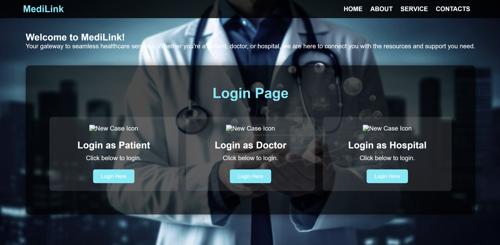

# Medilink Healthcare Portal

Healthcare management platform for patients, doctors and hospitals with centralized medical records and role-based dashboards.

## Overview

MediLink is a web-based healthcare management system designed to connect patients, doctors, and hospitals on a single platform. The system enables centralized medical record management, appointment handling, and role-based access through dedicated dashboards.

## Features

- Patient registration and login
- Doctor registration and login
- Hospital registration and login
- Role-based dashboards
- Medical record management
- Healthcare service coordination
- User-friendly web interface

## Technology Stack

- HTML
- CSS
- JavaScript
- Java

## Screenshots

### Home Page

### Patient Dashboard

### Doctor Dashboard

### Hospital Dashboard

## Project Structure

- HTML pages for user interfaces
- CSS files for styling
- JavaScript for client-side functionality
- Images and assets
- Role-based dashboard modules

## Author

Yashashri Penikalapati
